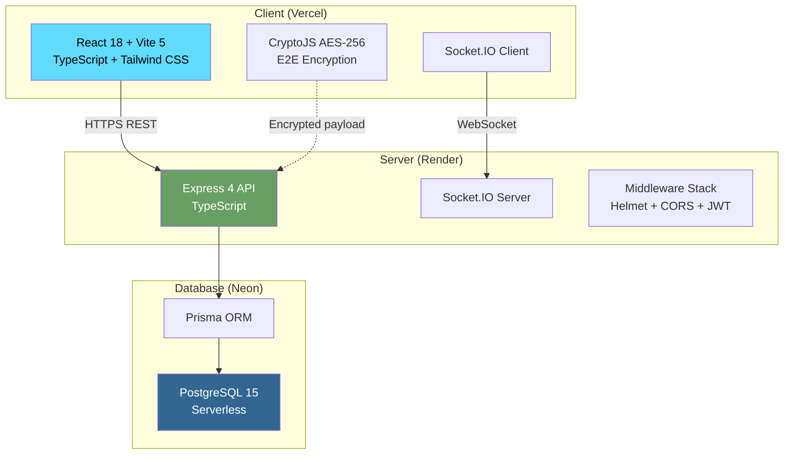
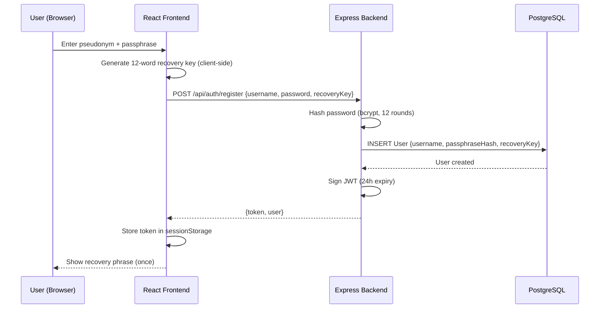
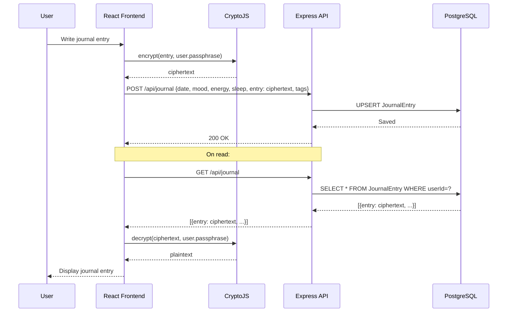
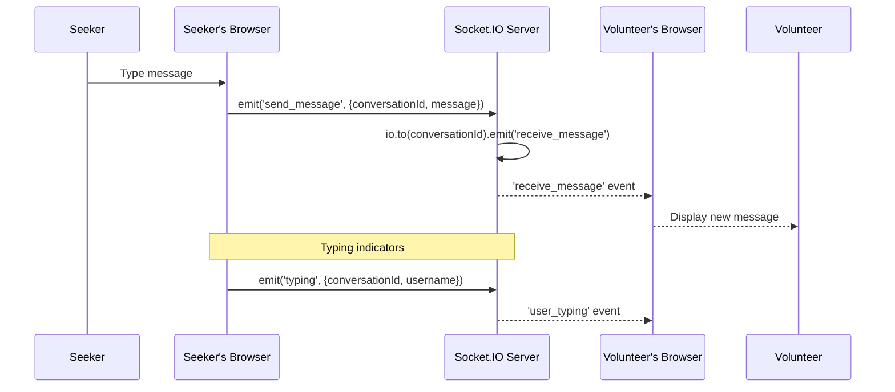
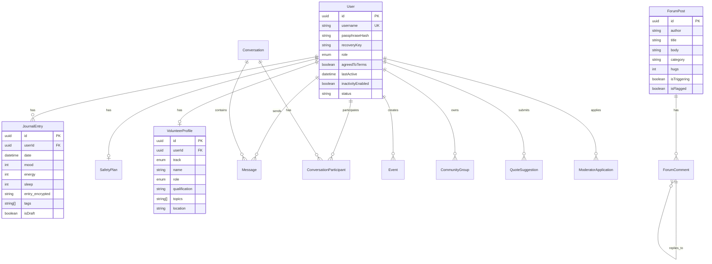
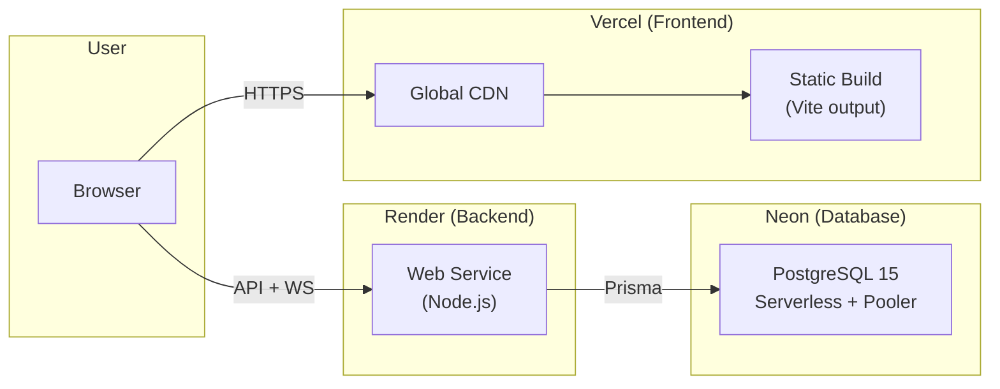

# SafeHaven — System Architecture & Technical Design Document (TDD)

**Version:** 1.0
**Last Updated:** March 27, 2026

---

## 1. System Overview



---

## 2. Technology Stack

| Layer | Technology | Version | Purpose |
|-------|-----------|---------|---------|
| **Frontend** | React | 18.2 | UI framework |
| | Vite | 5.0 | Build tool / dev server |
| | TypeScript | 5.2 | Type safety |
| | Tailwind CSS | 3.3 | Styling |
| | Lucide React | 0.555 | Icon library |
| | Socket.IO Client | 4.8 | Real-time messaging |
| | CryptoJS | 4.2 | Client-side encryption |
| | React Router | 6.20 | SPA routing |
| **Backend** | Node.js | 18+ | Runtime |
| | Express | 4.18 | HTTP framework |
| | TypeScript | 5.1 | Type safety |
| | Prisma | 5.22 | ORM |
| | Socket.IO | 4.8 | WebSocket server |
| | Helmet | 7.0 | Security headers |
| | Zod | 4.3 | Request validation |
| | bcryptjs | 2.4 | Password hashing |
| | jsonwebtoken | 9.0 | JWT auth |
| **Database** | PostgreSQL | 15 | Primary database |
| | Neon | Serverless | Managed hosting |
| **Hosting** | Vercel | - | Frontend CDN + SSG |
| | Render | - | Backend compute |

---

## 3. Data Flow Architecture

### 3.1 Authentication Flow



### 3.2 Journal Entry Flow (E2E Encryption)



### 3.3 Real-Time Chat Flow



---

## 4. Database Schema

### 4.1 Entity-Relationship Diagram



### 4.2 Complete Model List (16 Models)

| Model | Purpose | Key Fields |
|-------|---------|-----------|
| `User` | User accounts | username, role, passphraseHash |
| `VolunteerProfile` | Volunteer details | track, qualification, verified |
| `JournalEntry` | Encrypted journal | entry (ciphertext), mood, tags |
| `SafetyPlan` | Crisis plan | warningSigns, copingStrategies (encrypted) |
| `ForumPost` | Forum threads | title, body, category, hugs |
| `ForumComment` | Nested replies | body, parentId, postId |
| `Conversation` | Chat rooms | type (dm/group), participants |
| `ConversationParticipant` | Chat membership | userId, conversationId |
| `Message` | Chat messages | content (encrypted), senderName |
| `Resource` | Library content | type (ARTICLE/BOOK/VIDEO/QUOTE) |
| `Event` | Community events | date, location, status |
| `CommunityGroup` | Support groups | platform, safetyRating, status |
| `Organization` | NGO listings | name, description, status |
| `QuoteSuggestion` | User-submitted quotes | text, author, status |
| `VolunteerApplication` | Application forms | name, role, status |
| `AuditLog` | Admin audit trail | action, targetIdHash, details |
| `ModeratorApplication` | Mod applications | reason, status |
| `SystemSetting` | Platform config | key-value pairs |

---

## 5. API Routes

### 5.1 Route Map

| Group | Base Path | Routes |
|-------|-----------|--------|
| **Auth** | `/api/auth` | `POST /register`, `POST /login`, `POST /recover`, `GET /me`, `DELETE /nuke`, `PATCH /settings`, `POST /moderator-apply` |
| **Journal** | `/api/journal` | `GET /`, `POST /`, `DELETE /:id` |
| **Forum** | `/api/forum` | `GET /`, `POST /`, `GET /:id/comments`, `POST /:id/comments`, `POST /:id/hug`, `POST /:id/flag`, `POST /:id/dismiss`, `DELETE /:id` |
| **Chat** | `/api/chat` | `GET /conversations`, `GET /:id/messages`, `POST /:id/messages` |
| **Volunteers** | `/api/volunteers` | `GET /`, `GET /me`, `GET /:id`, `POST /apply` |
| **Safety** | `/api/safety` | `GET /`, `PUT /` |
| **Community** | `/api/community` | `GET /groups`, `GET /events`, `GET /organizations`, `GET /quotes`, `GET /resources`, `POST /groups`, `POST /events`, `POST /organizations`, `POST /quotes` |
| **Admin** | `/api/admin` | `GET /stats`, `GET /users`, `GET /audit-logs`, `GET /applications`, `POST /applications/:id/approve|reject`, `GET /flagged-posts`, CRUD `/articles`, `GET /ugc/pending`, `POST /ugc/:type/:id/:action`, mod applications, system settings |

### 5.2 Authentication Middleware

All protected routes use JWT Bearer token authentication:
```
Authorization: Bearer <jwt_token>
```

Admin routes additionally verify `user.role === 'ADMIN'`.

---

## 6. Security Architecture

### 6.1 Defense in Depth

```
Layer 1: Network        → HTTPS (TLS 1.3), CORS whitelist, Helmet headers
Layer 2: Authentication → JWT tokens (24h expiry), bcrypt (12 rounds)
Layer 3: Authorization  → Role-based access control (USER/VOLUNTEER/ADMIN)
Layer 4: Data           → AES-256 E2E encryption (journal, safety plan, messages)
Layer 5: Session        → 15-min inactivity timeout, sessionStorage (not localStorage)
Layer 6: Privacy        → Zero PII collection, pseudonymous accounts
Layer 7: Audit          → All admin actions logged with hashed target IDs
```

### 6.2 Encryption Model

| Data Type | Encryption | Location | Key |
|-----------|-----------|----------|-----|
| Passwords | bcrypt (12 rounds) | Server | N/A (one-way hash) |
| Journal entries | AES-256 (CryptoJS) | Client | User's passphrase |
| Safety plan fields | AES-256 (CryptoJS) | Client | User's passphrase |
| Chat messages | Stored encrypted | Server | Server-managed |
| Recovery keys | Stored encrypted | Server | Server-managed |

---

## 7. Frontend Architecture

### 7.1 Page Structure (18 Pages)

```
src/pages/
├── HomePage.tsx              # Landing page (public)
├── AuthPage.tsx               # Login / recovery
├── SeekerSignupPage.tsx       # Registration
├── VolunteerApplyPage.tsx     # Volunteer application
├── SeekerDashboard.tsx        # Journal + Safety Plan
├── VolunteerDashboard.tsx     # Volunteer panel
├── AdminDashboard.tsx         # Admin control panel
├── DeveloperDashboard.tsx     # Dev tools
├── ChatPage.tsx               # Real-time messaging
├── VolunteerNetworkPage.tsx   # Browse volunteers
├── CommunityPage.tsx          # Groups + Events
├── ResourcesPage.tsx          # Library
├── ForumPage.tsx              # Support forum
├── ToolsPage.tsx              # Utility tools
├── SecurityCenterPage.tsx     # Security settings
├── PrivacyPolicyPage.tsx      # Legal
├── TermsPage.tsx              # Legal
└── SecurityWhitepaperPage.tsx # Transparency
```

### 7.2 State Management

- **AuthContext** — User session, login/logout/register functions
- **ThemeContext** — Dark/light mode toggle
- **sessionStorage** — JWT token persistence (cleared on tab close)

---

## 8. Deployment Architecture



| Component | Host | URL |
|-----------|------|-----|
| Frontend | Vercel | `https://safehavenkenya.vercel.app` |
| Backend | Render | `https://safehaven-backend-hmes.onrender.com` |
| Database | Neon | PostgreSQL connection string (env var) |

---

## 9. Environment Variables

### Backend (Render)

| Variable | Description |
|----------|------------|
| `DATABASE_URL` | PostgreSQL connection string (Neon pooler) |
| `JWT_SECRET` | Secret key for signing JWT tokens |
| `PORT` | Server port (default: 5000) |
| `CLIENT_URL` | Frontend URL for CORS whitelist |

### Frontend (Vercel)

| Variable | Description |
|----------|------------|
| `VITE_API_URL` | Backend API base URL (e.g., `https://safehaven-backend-hmes.onrender.com/api`) |
